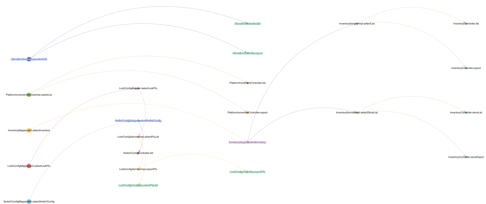

#### [中文简体](https://github.com/baikaishuipp/jcci/blob/main/README.cn.md) OR [EN](https://github.com/baikaishuipp/jcci/blob/main/README.md)
# jcci

#### Description
Java code commit impact analysis, is a pure python library that analyzes the impact of two git submissions of Java projects on the project and generates tree chart data.

PYPI: [jcci](https://pypi.org/project/jcci/)

#### Software Architecture
The general principle is the same as Find Usage of Idea, locate the impact of the code through code changes, and continuously traverse the affected classes and methods until the top controller layer is found

The code is mainly written by python and mainly involves 2 libraries:

* javalang  java file syntax parsing library
* unidiff  git diff information parsing library

Obtain information such as import class extends implements declarators methods of each Java file through javalang syntax analysis

Parse git diff information through unidiff (diff file, added_line_num, removed_lin_num)

Then judge which classes and methods are affected according to the code lines added or deleted in the file, and continuously traverse the affected classes and methods until you find the top controller layer

By passing in the commit id of the project git address branch twice, the impact of code changes between the two commit ids can be analyzed, and the tree diagram data can be generated to display the affected links.

#### Installation
```
pip install jcci
```

#### Instructions
Start a new python project, add a new python file, code example:

```
from jcci import jcci

jcci.analyze('git@xxxx.git','master','commit_id1','commit_id2', 'username1')
```

At the same time, the project will be cloned in the directory and then analyzed to generate a file with the suffix format commit_id1...commit_id2.cci, which contains the tree diagram data generated by the analysis results, open jcci-result.html, upload analyze result file end with .cci, then can be displayed through the view.


##### CCI result


##### CCI result tree view



#### Contribution

1.  Fork the repository
2.  Create Feat_xxx branch
3.  Commit your code
4.  Create Pull Request

#### Communication
 comment：JCCI communication
